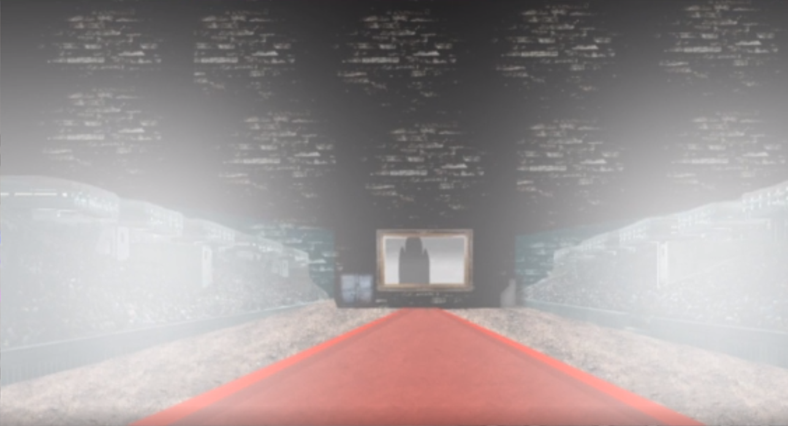
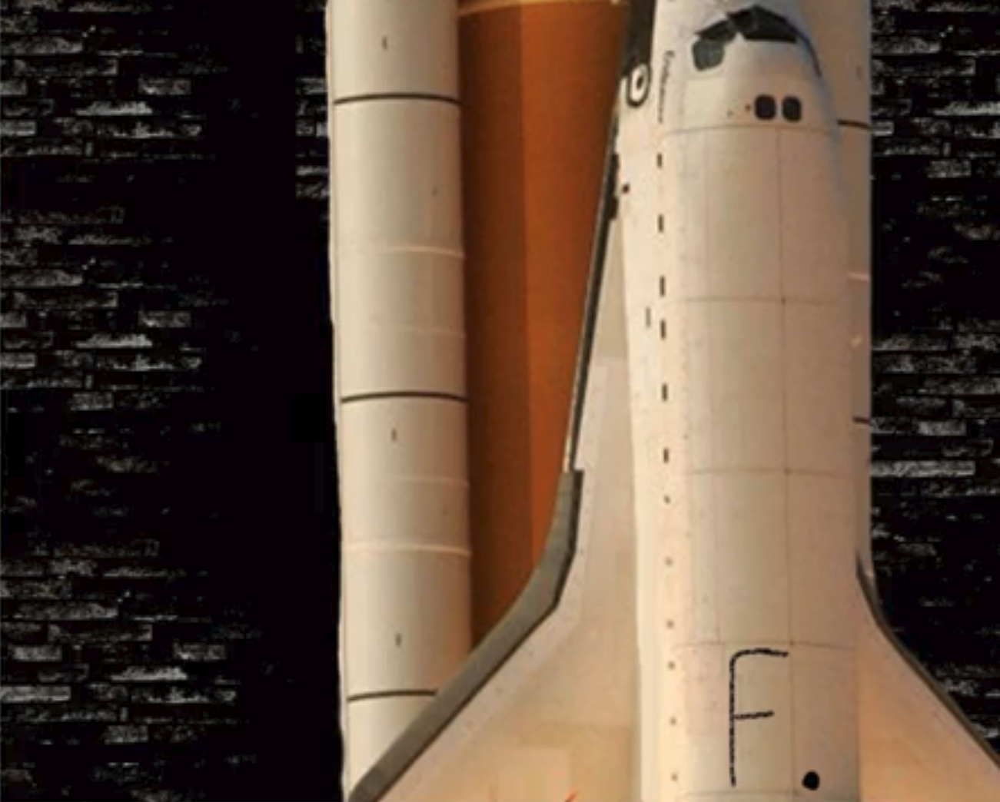
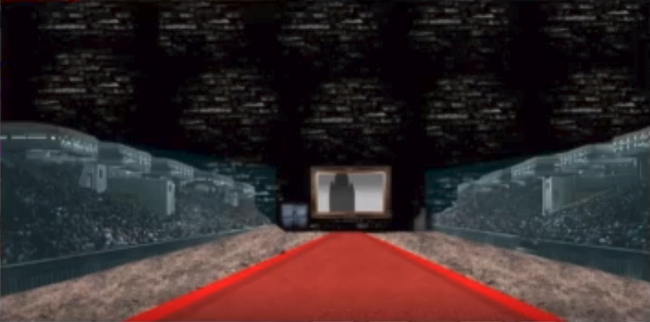
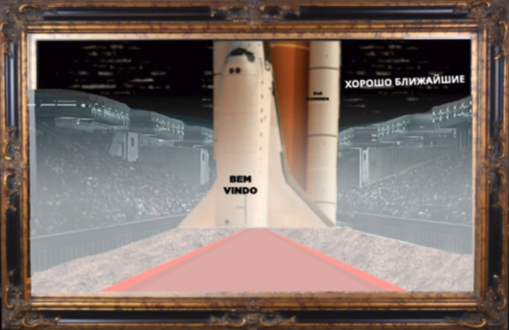
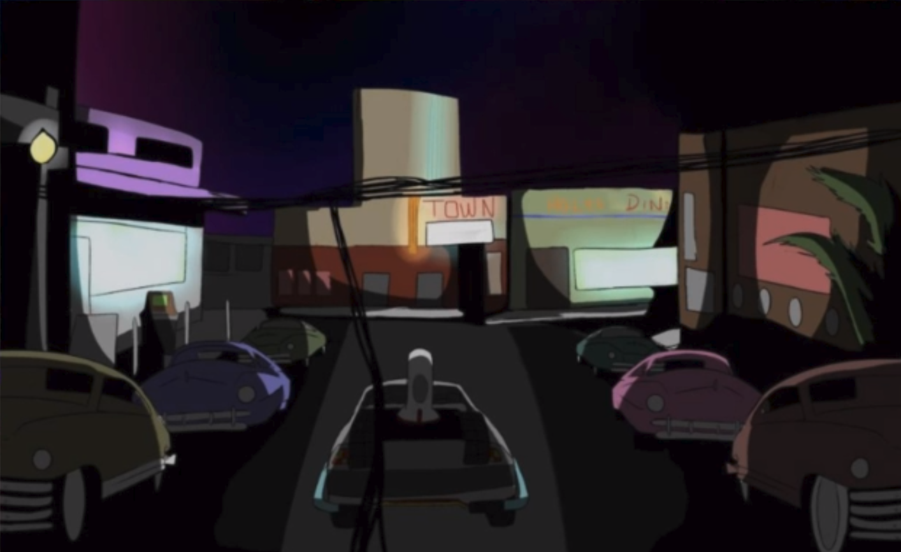
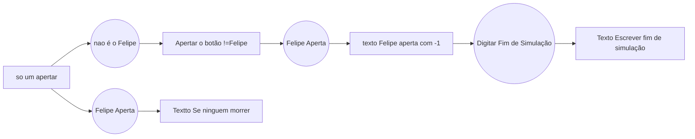

# RPG: Astronautas!

>Entregar aos jogadores:
	 ALFABETO
	

No ano de **2030**, é lançada a primeira missão tripulada para marte. Os afortunados a estarem abordo desta missão, são os melhores e mais completos astronautas de todo o mundo.

| Personagens| Qualidades | História | Item especial
|----------|------------ |-------| ------|
|Felipe | Pissicólogo engenheiro de software e de sistemas do instituto de aeronalticas e espaço Brasileiro | Por ser pissicologo sempre teve calma e paciencia para analizar todos a sua volta, mas nao apenas seres humanos, como tbm maquinas. | ATENCAO, PALAVRAS BR
|Rafael | medico agronomo e biologo alemão | um apaixonado pela vida, isso deu para ele a força necessaria para estudar quase tudo sobre qualquer tipo de vida terrestre. | PALAVRAS ALEMAO
|Gabriel | Médico e mecânico espacial russo | Um renomado medico na russia, mas nao deixou sua paixao pela medicina impedilo de conquista, o que pra si é o premio máximo que é ser o melhor e mais completo mecânico espacial da russia.	| PALAVRAS RUSSAS

As 6 horas da tarde do dia **23 de março de 2030**, os 3 a bordo do foguete **Witcher** estavam prontos para decolar. O rosto de seriedade está explicita, mas seus corações e suas emoções claramente é de euforia e felicidade, até porque eles seriam os primeiros humanos a pisar no tal planeta vermelho. Quando derrepente os 3 apagam, ao acordar, eles percebem que ainda estavam em terra firme, porem nao tinha mais nada no foguete. O Witcher, como era chamado, estava totalmente diferente, a unica coisa que tinha dentro eram 3 cadeiras, 1 painel com calendario eletronico e 1 botao escrito "abrir a porta".

## FASE 1

## Apertou o botão
Ao apertar o botao, a porta atras de vocês começa a se abrir, e de repente vocês começam a escutar muita gente falando, muitas vozes(é como uma plateia insurdessedora), tem uma luz aparentemente artificial está apontada diretamente para voçes, deixando a visão de vozes um pouco comprometida, ainda conseguem enxergar, mas nao conseguem ver detalhes.

## Olhar pela porta

Quando voçe(s) olham, olha para o lado e nota que tem uma multidão, como se fosse torcida de futibol, mas voçe nao consegue ver ninguem por causa dos holofotes, é um lugar totalmente fechado, com um tapete vermelho no chao que se estende a muito distante. Voçe consegue ver uma espécie de espelho no fundo, do lado do espelho, tem como se fosse uma caixa de metal do lado direito e no lado esquerdo uma porta de metal.

## Sair do foguete

A porta do foguete fecha com tudo de forma muito rápida, fazendo um barulho muito alto, o foguete se vira e os holofotes apagam, está tudo visível, agora conseguem enxergar os detalhes do local.

## Chegando no espelho

Olhando pro espelho, vcs percebem que bem fraquinho, tem várias vezes umas palavras escritas em certos lugares do espelho.

## Caixa de metal

O que se parecia uma caixa de metal, se mostra um terminal, com monitor e um teclado.

## Olhar pela porta

# Fase 2

Voces reconhecem essa cena, que seus pais aviam contado sobre um filme, chamado **De Volta Para o Futuro**, e que vocês até assistiram ele. Suas memórias buscam aos poucos, que esta cena remete a cena do relógio, e que o Delorian está no meio da fase.

*a fase 2, é nostalgica para muitos, ela é uma cópia da cena do relógio "DE VOLTA PARA O FUTURO", mas tem uma coisa que tenho certeza que está deixando todos confusos. Por que tudo aqui é cartoonizado? Nao só o local, mas vocês também, legal né? Ha 6 carros, algumas lojas e um cinema, com uma placa sem nada escrito. Ao lado de um dos carros há um terminal. Boa Sorte.*

## Dentro do Delorian

No painel há um local para botar data e hora para onde deseja ir, só que diferente de seu original, este nao consegue se locomover pelo espaço onde se encontra, o que o faz viajar no tempo, é um mistério.

## KaTeX

You can render LaTeX mathematical expressions using [KaTeX](https://khan.github.io/KaTeX/):

The *Gamma function* satisfying $\Gamma(n) = (n-1)!\quad\forall n\in\mathbb N$ is via the Euler integral

$$
\Gamma(z) = \int_0^\infty t^{z-1}e^{-t}dt\,.
$$

> You can find more information about **LaTeX** mathematical expressions [here](http://meta.math.stackexchange.com/questions/5020/mathjax-basic-tutorial-and-quick-reference).

## UML diagrams

___
### Apertar o botão != Felipe
Fica tudo preto, quando a luz acende, quem apertou está caido duro no chão. Aparentemente ele esta morto.

### Se ninguem morrer
Eles saem da simulação.

### Texto "Escrever fim de simulação"
Vocês dão enter e logo apos apagam denovo, vocês acordam no mesmo Witcher do inicio, com os Ainstains, quando olham pra tras, na porta, esta escrito "bem-vindos a simulação 0002", vocês apertam para abrir a porta, quando vocês saem, tem vários Rafaeis na plateia. Acabou.

### texto Felipe aperta com -1
Apaga todas as luzes, fica tudo escuro, quando Felipe acorda, voce nota que está dentro do Witcher, o Witcher original, na sua frente tem uma parede de metal que está escrito 0001, no lado direito está Rafael, Rafael está pálido, já Gabriel acorda junto com você.
Voces começão a ouvir um barunho atras de vocês, quando vocês olham é um terminal, que está escrito "Apenas uma chance, esse é o certo, continuem" e logo apos ela some. Podem digitar:

<!--stackedit_data:
eyJoaXN0b3J5IjpbMTA4MjE3MDQsLTI4MzI3MDgxMSwtNzAwMj
YzNzZdfQ==
-->
