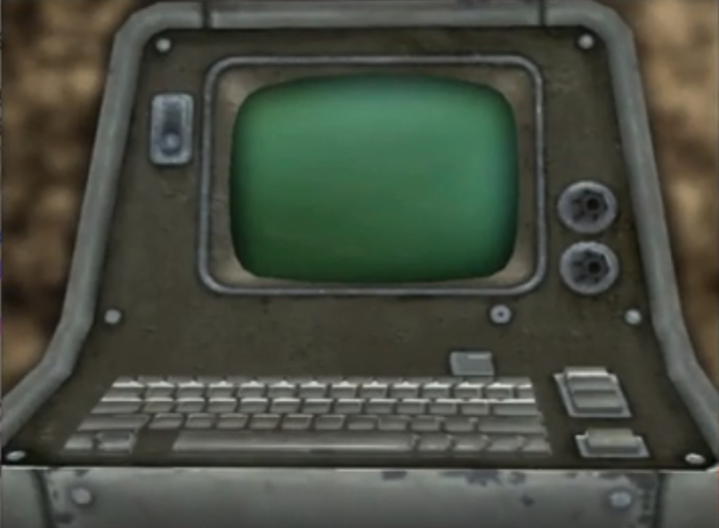

<link rel="stylesheet" href="https://stackedit.io/style.css" />

# RPG: Astronautas!

>Entregar aos jogadores:
	 ALFABETO
	

No ano de **2030**, é lançada a primeira missão tripulada para marte. Os afortunados a estarem abordo desta missão, são os melhores e mais completos astronautas de todo o mundo.

| Personagens| Qualidades | História | Item especial
|----------|------------ |-------| ------|
|Felipe | Pissicólogo engenheiro de software e de sistemas do instituto de aeronalticas e espaço Brasileiro | Por ser pissicologo sempre teve calma e paciencia para analizar todos a sua volta, mas nao apenas seres humanos, como tbm maquinas. | ATENCAO, PALAVRAS BR
|Rafael | medico agronomo e biologo alemão | um apaixonado pela vida, isso deu para ele a força necessaria para estudar quase tudo sobre qualquer tipo de vida terrestre. | PALAVRAS ALEMAO
|Gabriel | Médico e mecânico espacial russo | Um renomado medico na russia, mas nao deixou sua paixao pela medicina impedilo de conquista, o que pra si é o premio máximo que é ser o melhor e mais completo mecânico espacial da russia.	| PALAVRAS RUSSAS

As 6 horas da tarde do dia **23 de março de 2030**, os 3 a bordo do foguete **Witcher** estavam prontos para decolar. O rosto de seriedade está explicita, mas seus corações e suas emoções claramente é de euforia e felicidade, até porque eles seriam os primeiros humanos a pisar no tal planeta vermelho. Quando derrepente os 3 apagam, ao acordar, eles percebem que ainda estavam em terra firme, porem nao tinha mais nada no foguete. O Witcher, como era chamado, estava totalmente diferente, a unica coisa que tinha dentro eram 3 cadeiras, 1 painel com calendario eletronico e 1 botao escrito "abrir a porta".

## FASE 1

## Apertou o botão
Ao apertar o botao, a porta atras de vocês começa a se abrir, e de repente vocês começam a escutar muita gente falando, muitas vozes(é como uma plateia insurdessedora), tem uma luz aparentemente artificial está apontada diretamente para voçes, deixando a visão de vozes um pouco comprometida, ainda conseguem enxergar, mas nao conseguem ver detalhes.

## Olhar pela porta

Quando voçe(s) olham, olha para o lado e nota que tem uma multidão, como se fosse torcida de futibol, mas voçe nao consegue ver ninguem por causa dos holofotes, é um lugar totalmente fechado, com um tapete vermelho no chao que se estende a muito distante. Voçe consegue ver uma espécie de espelho no fundo, do lado do espelho, tem como se fosse uma caixa de metal do lado direito e no lado esquerdo uma porta de metal.

## Sair do foguete

A porta do foguete fecha com tudo de forma muito rápida, fazendo um barulho muito alto, o foguete se vira e os holofotes apagam, está tudo visível, agora conseguem enxergar os detalhes do local.
<iframe width="100%" height="300" scrolling="no" frameborder="no" allow="autoplay" src="https://w.soundcloud.com/player/?url=https%3A//api.soundcloud.com/tracks/585308496&color=%23ff5500&auto_play=false&hide_related=false&show_comments=true&show_user=true&show_reposts=false&show_teaser=true&visual=true"></iframe>

## Chegando no espelho

Olhando pro espelho, vcs percebem que bem fraquinho, tem várias vezes umas palavras escritas em certos lugares do espelho.

## Caixa de metal

O que se parecia uma caixa de metal, se mostra um terminal, com monitor e um teclado.

## Olhar pela porta

# Fase 2

Voces reconhecem essa cena, que seus pais aviam contado sobre um filme, chamado **De Volta Para o Futuro**, e que vocês até assistiram ele. Suas memórias buscam aos poucos, que esta cena remete a cena do relógio, e que o Delorian está no meio da fase.

*a fase 2, é nostalgica para muitos, ela é uma cópia da cena do relógio "DE VOLTA PARA O FUTURO", mas tem uma coisa que tenho certeza que está deixando todos confusos. Por que tudo aqui é cartoonizado? Nao só o local, mas vocês também, legal né? Ha 6 carros, algumas lojas e um cinema, com uma placa sem nada escrito. Ao lado de um dos carros há um terminal. Boa Sorte.*

## Dentro do Delorian

No painel há um local para botar data e hora para onde deseja ir, só que diferente de seu original, este nao consegue se locomover pelo espaço onde se encontra, o que o faz viajar no tempo, é um mistério.

## KaTeX

You can render LaTeX mathematical expressions using [KaTeX](https://khan.github.io/KaTeX/):

The *Gamma function* satisfying $\Gamma(n) = (n-1)!\quad\forall n\in\mathbb N$ is via the Euler integral

$$
\Gamma(z) = \int_0^\infty t^{z-1}e^{-t}dt\,.
$$

> You can find more information about **LaTeX** mathematical expressions [here](http://meta.math.stackexchange.com/questions/5020/mathjax-basic-tutorial-and-quick-reference).

## UML diagrams

<svg xmlns="http://www.w3.org/2000/svg" id="mermaid-svg-b9WidFxjtXON4zSq" width="100%" style="max-width: 1508.5px;" viewBox="0 0 1508.5 335.5859375"><g transform="translate(-12, -12)"><g class="output"><g class="clusters"></g><g class="edgePaths"><g class="edgePath" style="opacity: 1;"><path class="path" d="M101.67768011896902,176.91015625L161.984375,117.0859375L186.984375,117.0859375" marker-end="url(#arrowhead239)" style="fill:none"></path><defs><marker id="arrowhead239" viewBox="0 0 10 10" refX="9" refY="5" markerUnits="strokeWidth" markerWidth="8" markerHeight="6" orient="auto"><path d="M 0 0 L 10 5 L 0 10 z" class="arrowheadPath" style="stroke-width: 1; stroke-dasharray: 1, 0;"></path></marker></defs></g><g class="edgePath" style="opacity: 1;"><path class="path" d="M304.578125,117.0859375L329.578125,117.0859375L359.828125,117.0859375" marker-end="url(#arrowhead240)" style="fill:none"></path><defs><marker id="arrowhead240" viewBox="0 0 10 10" refX="9" refY="5" markerUnits="strokeWidth" markerWidth="8" markerHeight="6" orient="auto"><path d="M 0 0 L 10 5 L 0 10 z" class="arrowheadPath" style="stroke-width: 1; stroke-dasharray: 1, 0;"></path></marker></defs></g><g class="edgePath" style="opacity: 1;"><path class="path" d="M550.84375,117.0859375L581.09375,117.0859375L606.09375,117.0859375" marker-end="url(#arrowhead241)" style="fill:none"></path><defs><marker id="arrowhead241" viewBox="0 0 10 10" refX="9" refY="5" markerUnits="strokeWidth" markerWidth="8" markerHeight="6" orient="auto"><path d="M 0 0 L 10 5 L 0 10 z" class="arrowheadPath" style="stroke-width: 1; stroke-dasharray: 1, 0;"></path></marker></defs></g><g class="edgePath" style="opacity: 1;"><path class="path" d="M719.796875,117.0859375L744.796875,117.0859375L769.796875,117.0859375" marker-end="url(#arrowhead242)" style="fill:none"></path><defs><marker id="arrowhead242" viewBox="0 0 10 10" refX="9" refY="5" markerUnits="strokeWidth" markerWidth="8" markerHeight="6" orient="auto"><path d="M 0 0 L 10 5 L 0 10 z" class="arrowheadPath" style="stroke-width: 1; stroke-dasharray: 1, 0;"></path></marker></defs></g><g class="edgePath" style="opacity: 1;"><path class="path" d="M974.625,117.0859375L999.625,117.0859375L1024.625,117.0859375" marker-end="url(#arrowhead243)" style="fill:none"></path><defs><marker id="arrowhead243" viewBox="0 0 10 10" refX="9" refY="5" markerUnits="strokeWidth" markerWidth="8" markerHeight="6" orient="auto"><path d="M 0 0 L 10 5 L 0 10 z" class="arrowheadPath" style="stroke-width: 1; stroke-dasharray: 1, 0;"></path></marker></defs></g><g class="edgePath" style="opacity: 1;"><path class="path" d="M1218.796875,117.0859375L1243.796875,117.0859375L1268.796875,117.0859375" marker-end="url(#arrowhead244)" style="fill:none"></path><defs><marker id="arrowhead244" viewBox="0 0 10 10" refX="9" refY="5" markerUnits="strokeWidth" markerWidth="8" markerHeight="6" orient="auto"><path d="M 0 0 L 10 5 L 0 10 z" class="arrowheadPath" style="stroke-width: 1; stroke-dasharray: 1, 0;"></path></marker></defs></g><g class="edgePath" style="opacity: 1;"><path class="path" d="M101.67768011896902,222.91015625L161.984375,282.734375L188.9296875,282.734375" marker-end="url(#arrowhead245)" style="fill:none"></path><defs><marker id="arrowhead245" viewBox="0 0 10 10" refX="9" refY="5" markerUnits="strokeWidth" markerWidth="8" markerHeight="6" orient="auto"><path d="M 0 0 L 10 5 L 0 10 z" class="arrowheadPath" style="stroke-width: 1; stroke-dasharray: 1, 0;"></path></marker></defs></g><g class="edgePath" style="opacity: 1;"><path class="path" d="M302.6328125,282.734375L329.578125,282.734375L354.578125,282.734375" marker-end="url(#arrowhead246)" style="fill:none"></path><defs><marker id="arrowhead246" viewBox="0 0 10 10" refX="9" refY="5" markerUnits="strokeWidth" markerWidth="8" markerHeight="6" orient="auto"><path d="M 0 0 L 10 5 L 0 10 z" class="arrowheadPath" style="stroke-width: 1; stroke-dasharray: 1, 0;"></path></marker></defs></g></g><g class="edgeLabels"><g class="edgeLabel" transform="" style="opacity: 1;"><g transform="translate(0,0)" class="label"><foreignObject width="0" height="0">

</foreignObject></g></g><g class="edgeLabel" transform="" style="opacity: 1;"><g transform="translate(0,0)" class="label"><foreignObject width="0" height="0">

</foreignObject></g></g><g class="edgeLabel" transform="" style="opacity: 1;"><g transform="translate(0,0)" class="label"><foreignObject width="0" height="0">

</foreignObject></g></g><g class="edgeLabel" transform="" style="opacity: 1;"><g transform="translate(0,0)" class="label"><foreignObject width="0" height="0">

</foreignObject></g></g><g class="edgeLabel" transform="" style="opacity: 1;"><g transform="translate(0,0)" class="label"><foreignObject width="0" height="0">

</foreignObject></g></g><g class="edgeLabel" transform="" style="opacity: 1;"><g transform="translate(0,0)" class="label"><foreignObject width="0" height="0">

</foreignObject></g></g><g class="edgeLabel" transform="" style="opacity: 1;"><g transform="translate(0,0)" class="label"><foreignObject width="0" height="0">

</foreignObject></g></g><g class="edgeLabel" transform="" style="opacity: 1;"><g transform="translate(0,0)" class="label"><foreignObject width="0" height="0">

</foreignObject></g></g></g><g class="nodes"><g class="node" id="A" transform="translate(78.4921875,199.91015625)" style="opacity: 1;"><rect rx="0" ry="0" x="-58.4921875" y="-23" width="116.984375" height="46"></rect><g class="label" transform="translate(0,0)"><g transform="translate(-48.4921875,-13)"><foreignObject width="96.984375" height="26">
so um apertar
</foreignObject></g></g></g><g class="node" id="B" transform="translate(245.78125,117.0859375)" style="opacity: 1;"><circle x="-58.796875" y="-23" r="58.796875"></circle><g class="label" transform="translate(0,0)"><g transform="translate(-48.796875,-13)"><foreignObject width="97.59375" height="26">
nao é o Felipe
</foreignObject></g></g></g><g class="node" id="D" transform="translate(455.3359375,117.0859375)" style="opacity: 1;"><rect rx="0" ry="0" x="-95.5078125" y="-23" width="191.015625" height="46"></rect><g class="label" transform="translate(0,0)"><g transform="translate(-85.5078125,-13)"><foreignObject width="171.015625" height="26">
Apertar o botão !=Felipe
</foreignObject></g></g></g><g class="node" id="E" transform="translate(662.9453125,117.0859375)" style="opacity: 1;"><circle x="-56.8515625" y="-23" r="56.8515625"></circle><g class="label" transform="translate(0,0)"><g transform="translate(-46.8515625,-13)"><foreignObject width="93.703125" height="26">
Felipe Aperta
</foreignObject></g></g></g><g class="node" id="F" transform="translate(872.2109375,117.0859375)" style="opacity: 1;"><rect rx="0" ry="0" x="-102.4140625" y="-23" width="204.828125" height="46"></rect><g class="label" transform="translate(0,0)"><g transform="translate(-92.4140625,-13)"><foreignObject width="184.828125" height="26">
texto Felipe aperta com -1
</foreignObject></g></g></g><g class="node" id="G" transform="translate(1121.7109375,117.0859375)" style="opacity: 1;"><circle x="-97.0859375" y="-23" r="97.0859375"></circle><g class="label" transform="translate(0,0)"><g transform="translate(-87.0859375,-13)"><foreignObject width="174.171875" height="26">
Digitar Fim de Simulação
</foreignObject></g></g></g><g class="node" id="H" transform="translate(1390.6484375,117.0859375)" style="opacity: 1;"><rect rx="0" ry="0" x="-121.8515625" y="-23" width="243.703125" height="46"></rect><g class="label" transform="translate(0,0)"><g transform="translate(-111.8515625,-13)"><foreignObject width="223.703125" height="26">
Texto Escrever fim de simulação
</foreignObject></g></g></g><g class="node" id="I" transform="translate(245.78125,282.734375)" style="opacity: 1;"><circle x="-56.8515625" y="-23" r="56.8515625"></circle><g class="label" transform="translate(0,0)"><g transform="translate(-46.8515625,-13)"><foreignObject width="93.703125" height="26">
Felipe Aperta
</foreignObject></g></g></g><g class="node" id="J" transform="translate(455.3359375,282.734375)" style="opacity: 1;"><rect rx="0" ry="0" x="-100.7578125" y="-23" width="201.515625" height="46"></rect><g class="label" transform="translate(0,0)"><g transform="translate(-90.7578125,-13)"><foreignObject width="181.515625" height="26">
Textto Se ninguem morrer
</foreignObject></g></g></g></g></g></g></svg>

___
### Apertar o botão != Felipe
Fica tudo preto, quando a luz acende, quem apertou está caido duro no chão. Aparentemente ele esta morto.

### Se ninguem morrer
Eles saem da simulação.

### Texto "Escrever fim de simulação"
Vocês dão enter e logo apos apagam denovo, vocês acordam no mesmo Witcher do inicio, com os Ainstains, quando olham pra tras, na porta, esta escrito "bem-vindos a simulação 0002", vocês apertam para abrir a porta, quando vocês saem, tem vários Rafaeis na plateia. Acabou.

### texto Felipe aperta com -1
Apaga todas as luzes, fica tudo escuro, quando Felipe acorda, voce nota que está dentro do Witcher, o Witcher original, na sua frente tem uma parede de metal que está escrito 0001, no lado direito está Rafael, Rafael está pálido, já Gabriel acorda junto com você.
Voces começão a ouvir um barunho atras de vocês, quando vocês olham é um terminal, que está escrito "Apenas uma chance, esse é o certo, continuem" e logo apos ela some. Podem digitar:

<!--stackedit_data:
eyJoaXN0b3J5IjpbLTIwMjMyNTkyNjksMTA4MjE3MDQsLTI4Mz
I3MDgxMSwtNzAwMjYzNzZdfQ==
-->
