# RPG: Astronautas - AÇÕES

## Ler calendário
A data constada em tal é **23 de dezembro de 2030**.

## Olhar a platéia

Quando apaga os holofotes, olham pra platei notam que todos tem corpos diferentes(corpos humanos), mas TODAS tem o rosto do Albert Einstain. 

Sobre os **Alberts**:
- Tem um Albert segurando um cartas marrom.
- Nao tem nada escrito no cartas marrom, é só um cartas marrom.
- Estão como se estivessem torcendo.
- seguem com os olhos. 

> Não estão com capacete
> Foguete antes da decolagem nao tinha o F nem o ponto(.)

| Terminal 1 | conseguencia |
|------------|--------------|
|DIGITAR QUALQUER COISA |  ERRO |
| TENTAR HACKEAR | você tenta hackear o terminal, mas percebe que ele utiliza uma linguagem que você nunca tinha visto antes de programação. |
|TRABALHO EM EQUIPE | |
| F.    | Voz fala, **"Vocês já viram o mundo de forma espelhada?"**|
| F.I.M. | voz no terminal fala **"VOCÊS REALMENTE ACREDITAM NELE?" "mostrem para ele"** |
|Albert |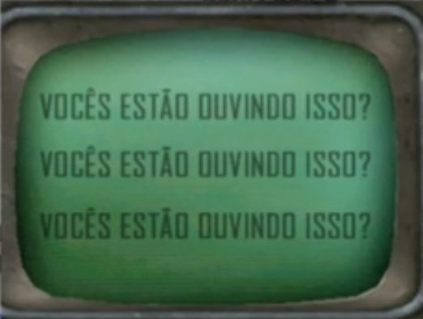 voz no terminal fala **"Iniciais são bonitas não acham? Consigo ver em todas as palavras"** |
| NAN |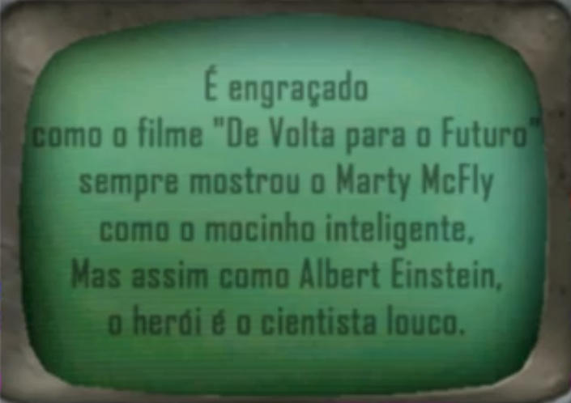 |
| Doctor Brown | O terminal apaga, voces escutam um barunho e a porta abre. |

## Ir na ponta do foguete
Você ao tocar a ponta do foguete, espera sentir um metal tão denso que consegue sentir até seu peso, mas você percebe que tem uma textura de colchão.

## Puxar
Ao tentar tirar ela desmorona e começa a cair em cima de você. No lugar da placa, tem um lugar, lembrando um quartinho, que está em estado deplorável, muito suja, onde contem uma escrita que lembra a vocês o "F", que está escrito um "i".

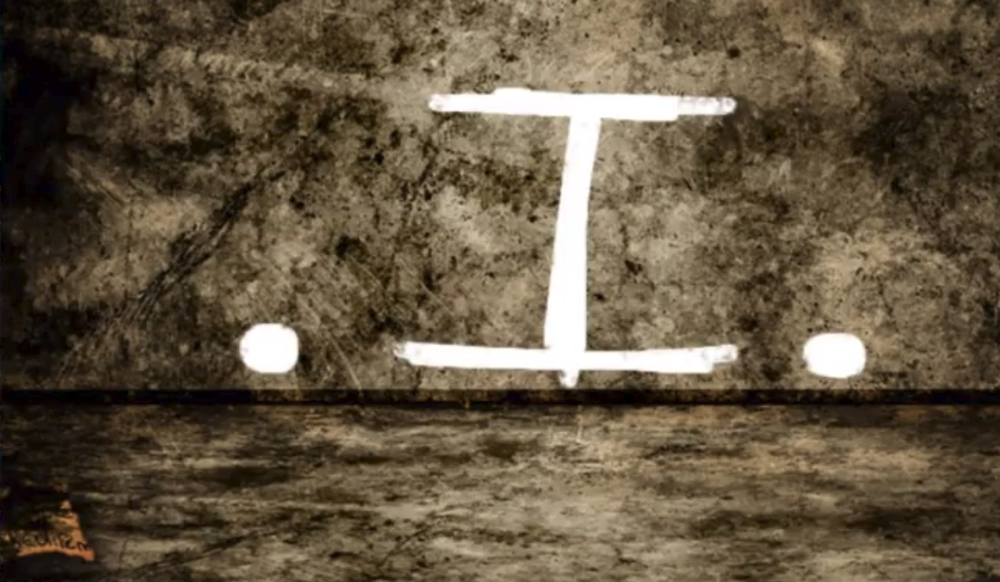

## Achar bilhete

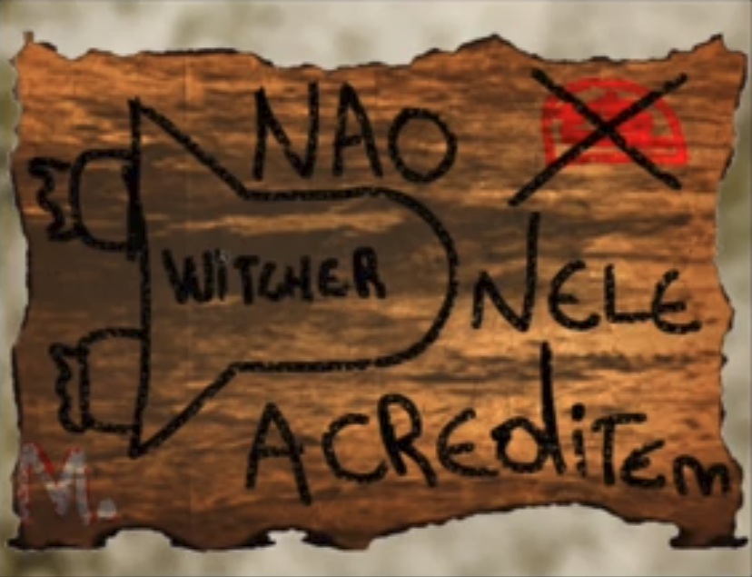

# Fase 2

## Olhar porta

A porta atras de vocês fecham com tudo, e vocês percebem que ela nao é cartoonizada, ela é uma porta normal, parecendo até serem mundos distintos.

## Abrir o carro

Ao abrir a porta, vocês percebem que o seu interior, igual a porta, não é cartoonizado.
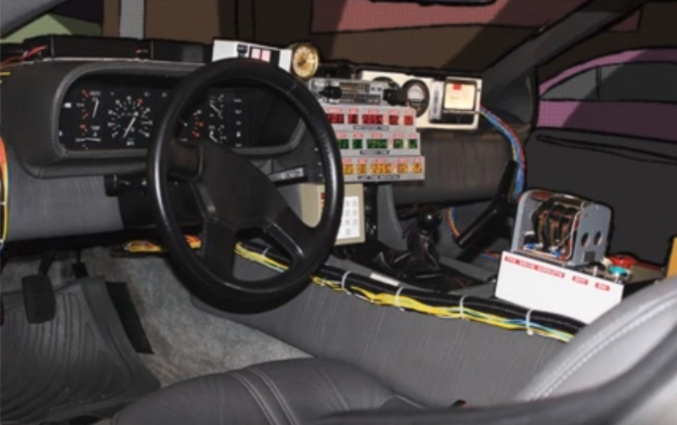

Em cima do banco do motorista, há um bilhete.
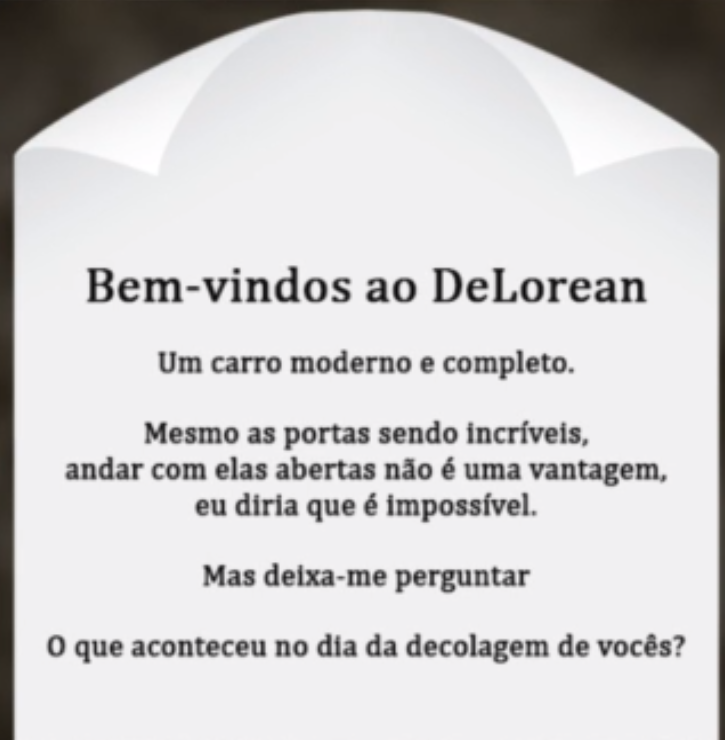

## Ir no terminal

O Terminal se mostra totalmente vazio.
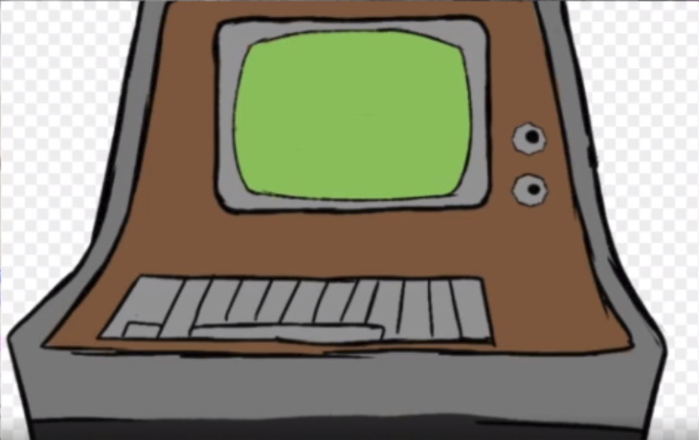

## Entrar os 3 no Delorian
Vocês lembram que o Delorian nao possui banco de tras, então alguem terá que sentar no colo do outro.

Delorian | Conseguencia |
|--------|--------------|
|00:00:00 | Começa a ouvir um barulho insurdessedor durante uns 2 seguntos, para o barulho e começa um barulho de fumaça do lado de fora. Ainda é o mesmo. **Averiguar**= vocês notam que a fumaça está saindo da parte de tras do carro, provavelmente deliberado por uma viagem no tempo. Terminal começa a piscar, e está escrito "Portas sempre fechadas". |
|23/04/30 | Terminal piscando. 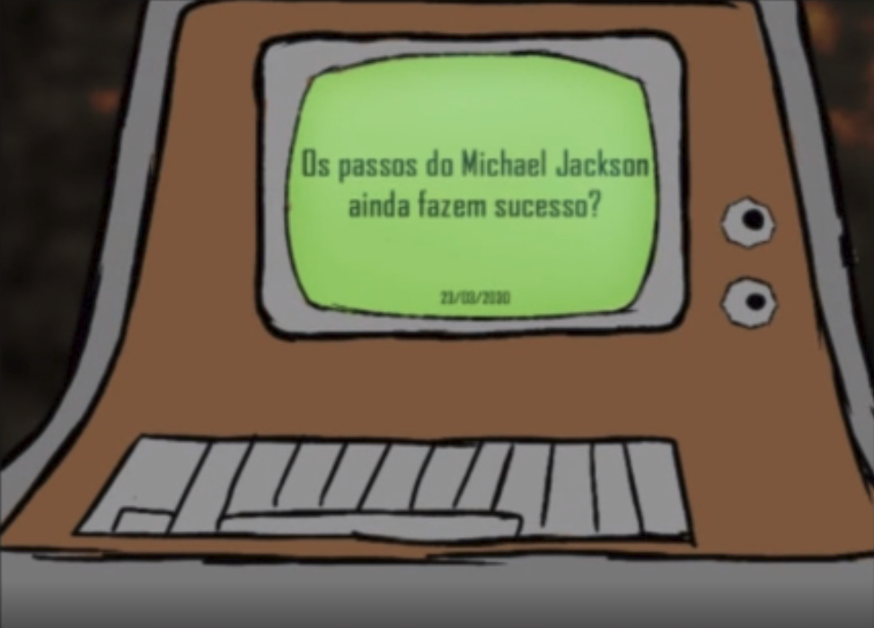 |
|23/12/30 | Tudo normal |
|03/02/32 | os carros tinham escrito algo. 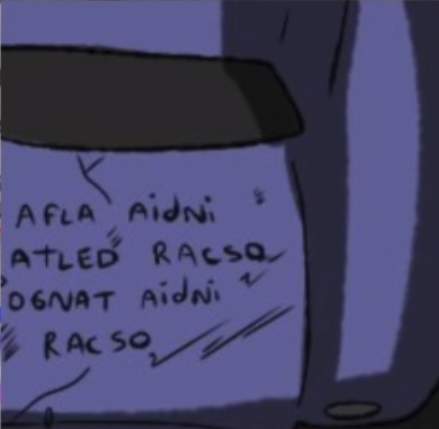 |
|08/02/32 | Terminal piscando muito forte. 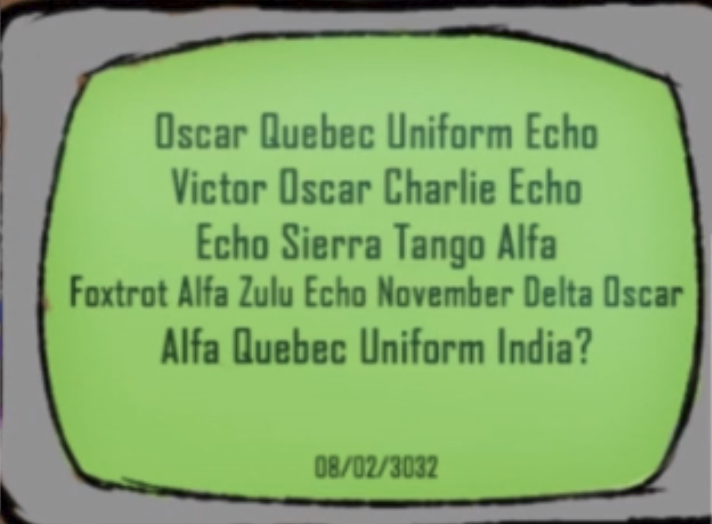 |
|08/02/32 DNV| Terminal piscando muito forte. 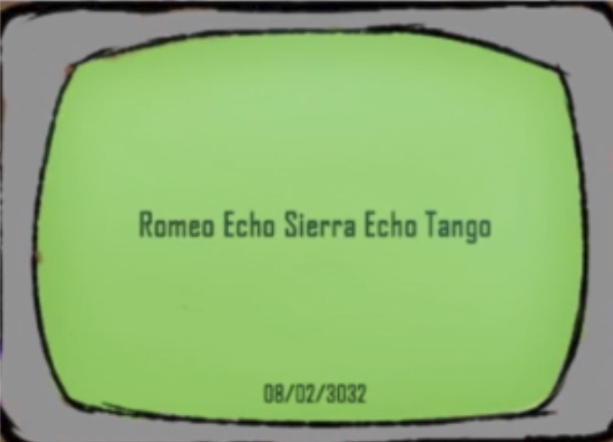 |
|08/03/2030 | Quando vocês saem do carro, notam que tudo ao seu redor mudou. 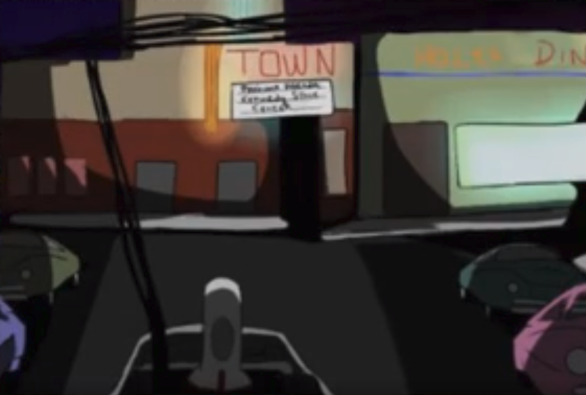  **Filme: proxima parada, Kened Space Center**. terminal começa a piscar muito 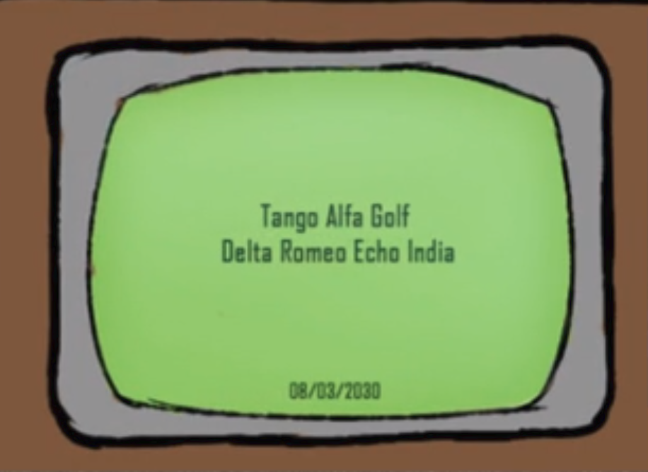 |
|03/03/2030 | Terminal está piscando denovo. 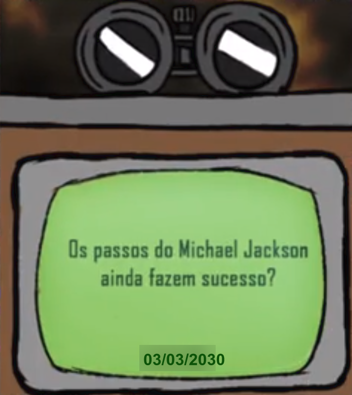 Terminal fala **"existem datas binárias? 01 é tão legal, eu sou todo feito de 0s e 1s"** |    
|01/01/1010 | Quando saem do carro percebem que a placa do cinema voltou e que aparece isso no terminal. **"siglas de filme..."** 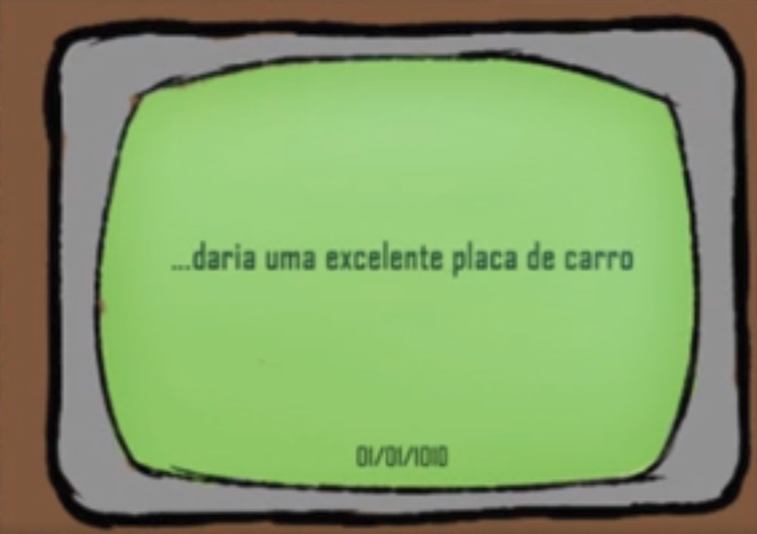 | 
|11/11/1111| A porta da primeira fase está aberta, e vocês voltam a escutar todos os alberts gritando dnv.Por um momento eles ficam em silencio, e todos fazem o sinal de numero 1 |
|31/12/0001 | Ao sair do carro vocês notam, que atras de um dos carros tem: 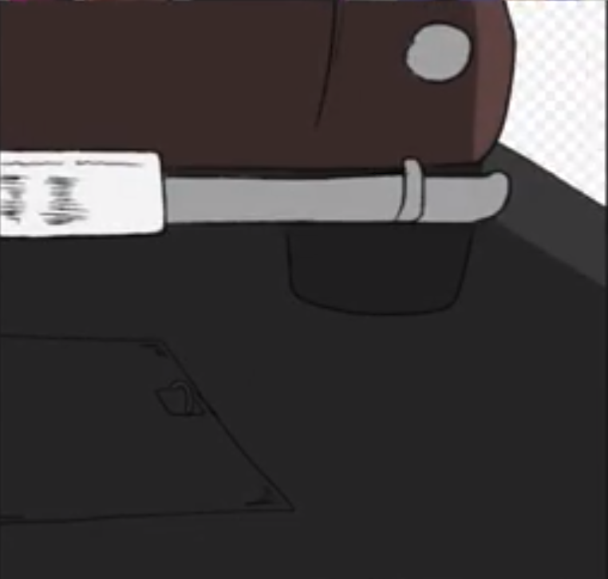 |

## Ir apenas 1 ou 2 pessoas
Para os que estão dentro, tudo ocorre da mesma maneira anterior, para o de fora, nada ocorre.

## Pessoa DE Fora ABRIR A PORTA
não tem ninguem lá dentro.

## Escrever KSC
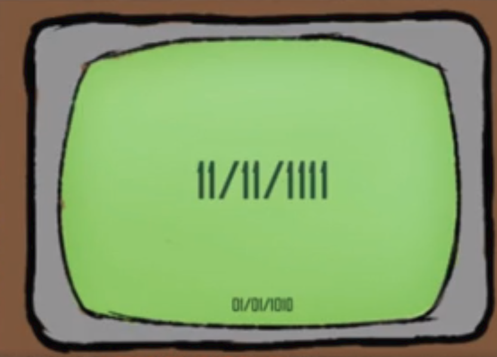 

## Olhar para cima

Quando vocês olham para cima, vocês veem isso.
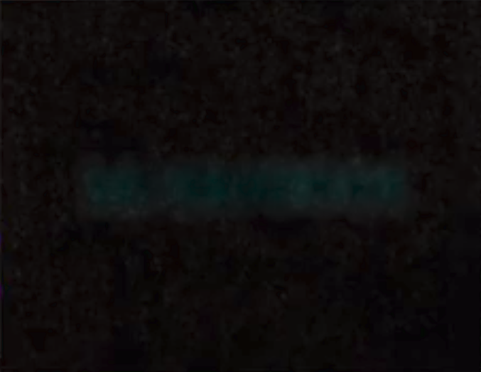

## Olhar para cima com Binoculo
Terminal está piscando escrito "D.E."
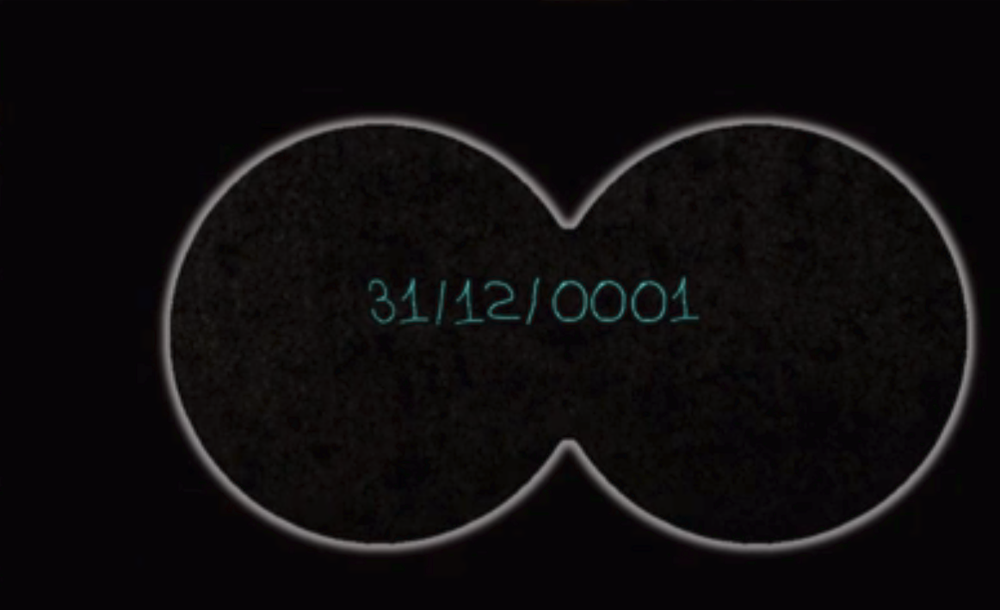

## Todos tentam ir no delorian para 31/12/0001
terminal **"VOCÊS VAO REALMENTE ACREDITAR NELE?"**, terminal fazendo piiiiiiiiiii
"vocês tem 20 segundos para decidir".

## Abrir alssapao

tem uma escada

## Descer
Ao descerem, vocês notam que a escada subiu, um vulto(em forma muito como de um humano) passando por cima e o alssapão fechou.

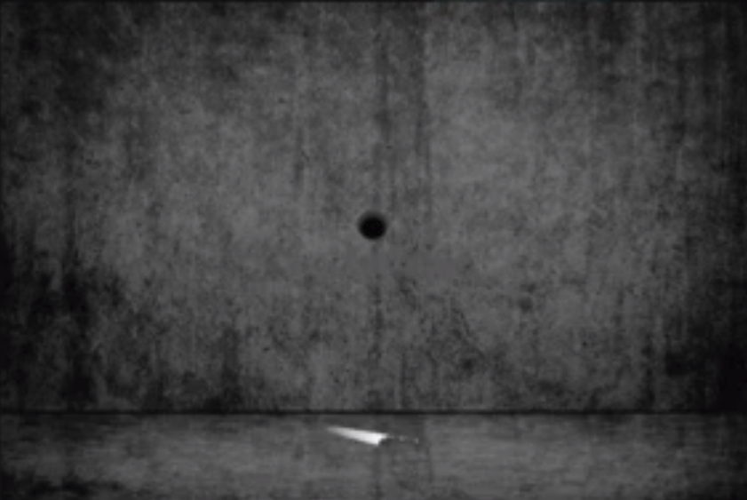

## Olhar o Lugar

Do lado esquerdo: 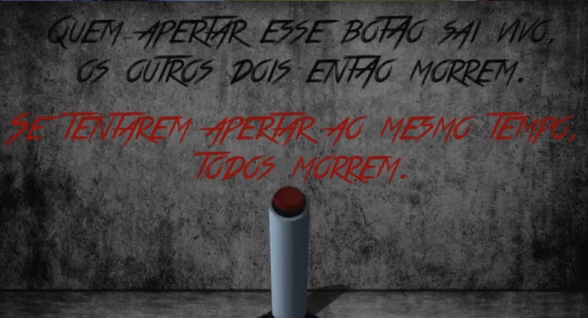
direito: 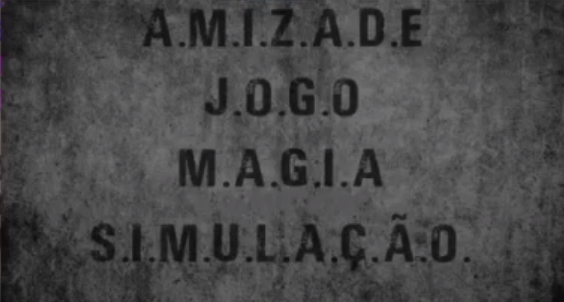 

> Buraco tem o tamanho perfeito para a faca entrar e descer.
> luz apaga, e todos os ainstaisn falam "nao creditem nele" durante 2 segundos

<!--stackedit_data:
eyJoaXN0b3J5IjpbMTYxNzU4MDA2OSwtMTE2Mjk2OTIwOF19
-->
